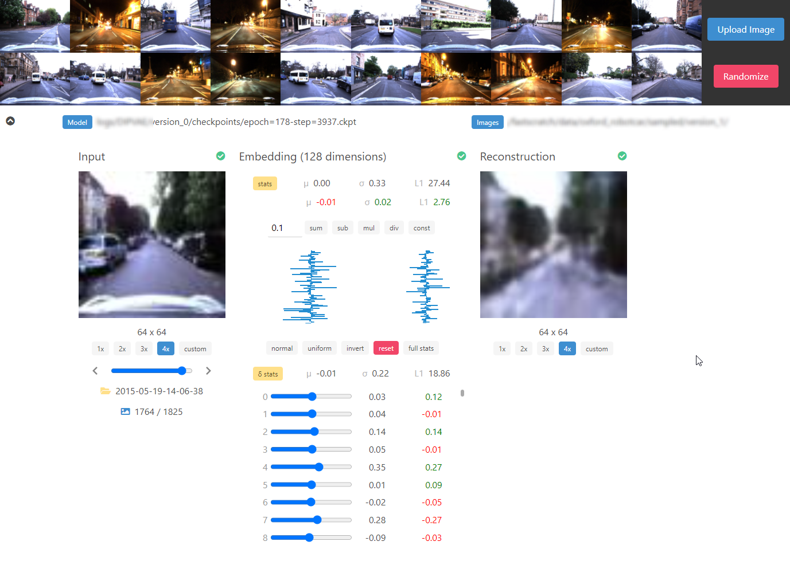

# VAE Embedding Visualization

A small, light and fast reactive web tool to quickly visualize VAE embeddings.

## Quick Start

### Client

```
git clone https://github.com/saravanabalagi/vae_visualization
cd vae_visualization
yarn install
yarn run build
```

### Server

- Copy given abstract [server.py](server/server.py) file to your python codebase
    - Only very minimal changes to `server.py` file are needed if your project is based on [PyTorch Lightning](https://github.com/PyTorchLightning/pytorch-lightning)
    - The code can easily be adapted to load other [Pytorch](https://pytorch.org/) models and with a little more effort, you should be able to load [tensorflow](https://www.tensorflow.org/) models as well just following the structure!
- Modify it to load your pretrained model from `ckpt_path`
- Keep all image directories under a single `img_dir` directory
- Make sure you build the client and modify `VAE_VISUALIZATION_CLIENT_PATH` to point to `repo/public`
- Run `python server.py <ckpt_path> <img_dir>` to start the server to load from ckpt

The visualization tool should now be available at `http://localhost:5000` in your browser:



Note that this is intended for research and development purposes, this requires more tweaks if you plan to use it in production. This tool may not efficiently handle multiple image directories with more than tens of thousands of images due to the way it serves autoindex jsons.

